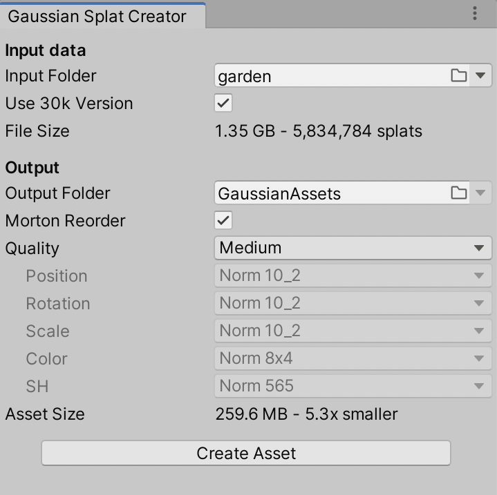

# Gaussian Splatting Virtual Reality rendering package for Unity

This rendering package enables Virtual Reality (VR) display of Gaussian Splatting (GS) point clouds. It builds on the rendering package created by Aras Pranckevičius to display Gaussian Splats in Unity; see https://github.com/aras-p/UnityGaussianSplatting. This rendering package is part of a publication for displaying CT scans as a GS cloud in VR, but should work with any data. See https://arxiv.org/abs/2410.16978

This fork adds two new capabilities:
- Rendering multi-layer Gaussian Splatting point cloud
- Virtual Reality rendering support

This repository has been tested and works with:
- HTC Vive series headsets
- Varjo Aero (probably others as well)
- Quest Pro, Quest 3

Quest 3 gets 72 fps stable until around 400k Gaussians with proper settings. Tethered devices with proper hardware a lot more. See https://www.youtube.com/watch?v=a6B9Ljci6iw for an example.

Do keep in mind this is experimental. Feel free to base your work on this.

### Changes to make VR work
This repository contains some changes for improved VR experiences:
- Uses Unity projection matrices in shaders where necessary
- Correctly handles the size of textures for eyes
- Shader adjustments to make Quest series devices work (tick box `GaussianSplatRenderer.cs` inspector)
- Backported AMD FFX sorting for the quest, selectable sorting algo
- Experimental Quest compatible RadixSort, see https://github.com/b0nes164/GPUSorting/issues/4
Probably forgot some more stuff.

### Usage

Follow the original steps to create a compressed GS representation in Unity. To render, use the included `GaussianSplatRenderer.cs` script which has been extended. Enable Quest compatibility to ensure rendering works for the Quest (also works on other headsets, maybe minor performance drawbacks). Enable center eye sorting for better performance at very slight image degradation. Adjust sorting frequency for the target hardware.

Check out the Demo scene, or the Quest .apk file from releases.

### Limitations

- Texture compression (BC7) currently does not work. This is because texture compression APIs are only available in the Editor, not the built application, and are needed for dynamic compression for layered display.
- Editing tools are not supported. If you need to edit a GS point cloud please use the original repo or another GS editor

### Related
If you like this work, ow want to get code to create multi-layer Gaussian Splatting representations, do check out https://github.com/roth-hex-lab/Multi-Layer-Gaussian-Splatting-for-Immersive-Anatomy-Visualization

If this is useful in a scientific work, please cite:
```
@misc{kleinbeck_multi-layer_2024,
    title = {Multi-{Layer} {Gaussian} {Splatting} for {Immersive} {Anatomy} {Visualization}},
    url = {http://arxiv.org/abs/2410.16978},
    doi = {10.48550/arXiv.2410.16978},
    publisher = {arXiv},
    author = {Kleinbeck, Constantin and Schieber, Hannah and Engel, Klaus and Gutjahr, Ralf and Roth, Daniel},
    month = oct,
    year = {2024},
    note = {arXiv:2410.16978},
    keywords = {Computer Science - Computer Vision and Pattern Recognition, Computer Science - Graphics},
}
```

<br>


Originally created by Aras Pranckevičius to render Gaussian Splats in Unity. Thank you very much for making this software open source. Please see the original readme below for more information:

<br><br><br>

# Gaussian Splatting playground in Unity

SIGGRAPH 2023 had a paper "[**3D Gaussian Splatting for Real-Time Radiance Field Rendering**](https://repo-sam.inria.fr/fungraph/3d-gaussian-splatting/)" by Kerbl, Kopanas, Leimkühler, Drettakis
that is really cool! Check out their website, source code repository, data sets and so on. I've decided to try to implement the realtime visualization part (i.e. the one that takes already-produced
gaussian splat "model" file) in Unity.


Everything in this repository is based on that "OG" gaussian splatting paper. Towards end of 2023, there's a ton of
[new gaussian splatting research](https://github.com/MrNeRF/awesome-3D-gaussian-splatting) coming out; _none_ of that is in this project.

Status as of 2023 December is that I'm not planning on any significant further developments.

## Usage

:warning: Note: this is all _**a toy**_ that I'm just playing around with. If you file bugs or feature requests, I will most likely just ignore them. I told you so! :warning:

Download or clone this repository, open `projects/GaussianExample` as a Unity project (I use Unity 2022.3, other versions might also work),
and open `GSTestScene` scene in there.

Note that the project requires DX12 or Vulkan on Windows, i.e. **DX11 will not work**. This is **not tested at all on mobile/web**, and probably
does not work there.



Next up, **create some GaussianSplat assets**: open `Tools -> Gaussian Splats -> Create GaussianSplatAsset` menu within Unity.
In the dialog, point `Input PLY File` to your Gaussian Splat file (note that it has to be a gaussian splat PLY file, not some 
other PLY file. E.g. in the official paper models, the correct files are under `point_cloud/iteration_*/point_cloud.ply`).
Optionally there can be `cameras.json` next to it or somewhere in parent folders.

Pick desired compression options and output folder, and press "Create Asset" button. The compression even at "very low" quality setting is decently usable, e.g. 
this capture at Very Low preset is under 8MB of total size (click to see the video): \
[](https://youtu.be/iccfV0YlWVI)

If everything was fine, there should be a GaussianSplat asset that has several data files next to it.

Since the gaussian splat models are quite large, I have not included any in this Github repo. The original
[paper github page](https://github.com/graphdeco-inria/gaussian-splatting) has a a link to
[14GB zip](https://repo-sam.inria.fr/fungraph/3d-gaussian-splatting/datasets/pretrained/models.zip) of their models.


In the game object that has a `GaussianSplatRenderer` script, **point the Asset field to** one of your created assets.
There are various controls on the script to debug/visualize the data, as well as a slider to move game camera into one of asset's camera
locations.

The rendering takes game object transformation matrix into account; the official gaussian splat models seem to be all rotated by about
-160 degrees around X axis, and mirrored around Z axis, so in the sample scene the object has such a transform set up.

Additional documentation:

* [Render Pipeline Integration](/docs/render-pipeline-integration.md)
* [Editing Splats](/docs/splat-editing.md)

_That's it!_


## Write-ups

My own blog posts about all this:
* [Gaussian Splatting is pretty cool!](https://aras-p.info/blog/2023/09/05/Gaussian-Splatting-is-pretty-cool/) (2023 Sep 5)
* [Making Gaussian Splats smaller](https://aras-p.info/blog/2023/09/13/Making-Gaussian-Splats-smaller/) (2023 Sep 13)
* [Making Gaussian Splats more smaller](https://aras-p.info/blog/2023/09/27/Making-Gaussian-Splats-more-smaller/) (2023 Sep 27)
* [Gaussian Explosion](https://aras-p.info/blog/2023/12/08/Gaussian-explosion/) (2023 Dec 8)

## Performance numbers:

"bicycle" scene from the paper, with 6.1M splats and first camera in there, rendering at 1200x797 resolution,
at "Medium" asset quality level (282MB asset file):

* Windows (NVIDIA RTX 3080 Ti):
  * Official SBIR viewer: 7.4ms (135FPS). 4.8GB VRAM usage.
  * Unity, DX12 or Vulkan: 6.8ms (147FPS) - 4.5ms rendering, 1.1ms sorting, 0.8ms splat view calc. 1.3GB VRAM usage.
* Mac (Apple M1 Max):
  * Unity, Metal: 21.5ms (46FPS).

Besides the gaussian splat asset that is loaded into GPU memory, currently this also needs about 48 bytes of GPU memory
per splat (for sorting, caching view dependent data etc.).


## License and External Code Used

The code I wrote for this is under MIT license. The project also uses several 3rd party libraries:

- [zanders3/json](https://github.com/zanders3/json), MIT license, (c) 2018 Alex Parker.
- "DeviceRadixSort" GPU sorting code contributed by Thomas Smith ([#82](https://github.com/aras-p/UnityGaussianSplatting/pull/82)).

However, keep in mind that the [license of the original paper implementation](https://github.com/graphdeco-inria/gaussian-splatting/blob/main/LICENSE.md)
says that the official _training_ software for the Gaussian Splats is for educational / academic / non-commercial
purpose; commercial usage requires getting license from INRIA. That is: even if this viewer / integration
into Unity is just "MIT license", you need to separately consider *how* did you get your Gaussian Splat PLY files.
